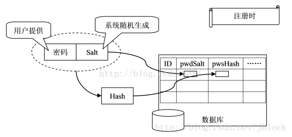
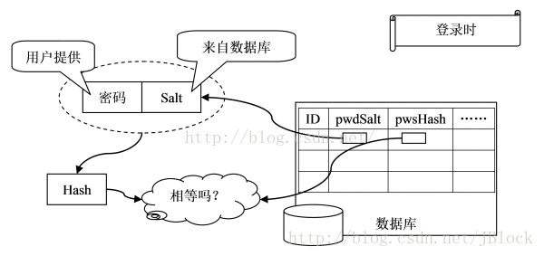

# node_restfull

## course 1  What is a RESTfull API ?

## Course 2 Planing & First Steps

```bash
npm init
npm install -s express 
touch server.js
touch app.js
```

```js
// server.js中

const http = require('http');
const app = require('./app')

const port = process.env.PORT || 3000;

const server = http.createServer(app);

server.listen(port);

```

```js
// app.js中
const express = require('express');
const app = express();

app.use(
    (req, res, next) => {
        res.status(200).json({
            message: 'It Works !'
        })
    }
)

module.exports = app;


```


## Course 3 Adding more Routes to the API


There is no difference. http.createServer() only does one thing: it calls http.Server() internally and returns the resulting instance.

## Course 4 Handing Error & improving the Project Setup 


* 安装nodemon package

```bash
# 安装nodemon
npm install nodemon --save-dev

# will fail because it's not a globalpackage installed on our machine , we can easily work around this by going to the package.json file 
nodemon server.js

```

```js
{
  "name": "rest-shop",
  "version": "1.0.0",
  "description": "A Node.js RESTful API Tutorial Project (Build a simple shop API)",
  "main": "index.js",
  "scripts": {
    "test": "echo \"Error: no test specified\" && exit 1",
    /**
     * here we can use nodemon which is a --save-dev package,because this will not search for our system but in our project and we just indtalled it 
    */
    "start" "nodemon server.js"
  },
  "keywords": [
    "node",
    "restful",
    "api"
  ],
  "author": "Maximilian Schwarzmüller",
  "license": "ISC",
  "dependencies": {
    "express": "^4.16.2"
  }
}

```

> 即我们不需要去全局的安装nodemon 就可以利用npm  指令去全局的使用nodemon, 了解这个使用的方式；

* 安装 morgan package --- logger middleware

>  it's a logging package for node.js we can use it really easy 

> we tell Express to funnel all requests through the morgan middleware worgan then will log something and let the request continue 


*  错误的处理方式： 见代码

## Course 5 Parsing the Body & Handing CORS 

### how we can extract the request body of an incoming request like let's say for a post request 

> doc 文档： https://www.npmjs.com/package/body-parser

```bash
npm install --save body-parser

# body-parser does not support files for example but it does support URL encoded bosies and it also supports json data .
# so if we receive a post request that comtains json data, we can use this middleware to parser data;

```

```js
// app.js 中

const bodyParser = require('body-parser');

/**
* apply the middleware to erery incoming requests
*
*/
// the bosyParser middleware need some additional information which kind of bodies do you want to parse first I want to parse the URL encoded bodies
// we can set extened to either true ro false , true allows you to parse extended bodies with rich data in it ; and dlase to only simple bodies for URL encoded data 
app.use(bodyParser.urlencoded({extended: true}));

// this will now extract JSON data and makes it easily to us 
app.use(bodyParser.json());

```

* bodyParser.json() 与 bodyParser.urlencoded() 的区别与联系
  + The bodyParser object exposes various factories to create middlewares. 也就是上述两者，都是bodyParser的中间件工厂方法，都会返回一个中间件
  + bodyParser.urlencoded() 接受form请求，bodyParser.json() 接受json请求
  + options可选 ， 这个方法返回一个仅仅用来解析json格式的中间件。这个中间件能接受任何body中任何Unicode编码的字符。支持自动的解析gzip和 zlib。
  + bodyParser.urlencoded(options) options可选，这个方法也返回一个中间件，这个中间件用来解析body中的urlencoded字符， 只支持utf-8的编码的字符。同样也支持自动的解析gzip和 zlib。

*  bodyParser.urlencoded({ extended: true }) 与 bodyParser.urlencoded({ extended: false })的区别：

```js
// bodyParser.urlencoded({ extended: true })的解析结果

{ 
   movie: { 
     _id: 'undefined',
     title: '电影名称11121',
     poster: 'http://r3.ykimg.com/05160000530EEB63675839160D0B79D5'
   } 
}

```

```js
// bodyParser.urlencoded({ extended: false }) 的解析结果
{ 
  'movie[_id]': 'undefined',
  'movie[title]': '电影名称11121',
  'movie[poster]': 'http://r3.ykimg.com/05160000530EEB63675839160D0B79D5'
}

// 既然选择了远方，便只顾风雨兼程；
```


### how we can handle a cors errors 

MDN参考文档：https://developer.mozilla.org/zh-CN/docs/Web/HTTP/Access_control_CORS


* 为什么我们使用postman不会面临跨域的问题，而使用浏览器则会面临跨域的问题： 跨域问题是浏览器的安全策略，如在不改动服务器的前提下，在浏览器上面安装一个插件，就可以实现跨域；

> as the default the browser is saying it doesn't make sense(明智的) for you to get something from that server which is not the server you html page coming from . that is a security concept , but for restfull api , we want allow this , because restfull api are meant to be consumed by by our clients by orservers and not just the server which is the api runs on   

> we don't server an application from that api, we just server data, therefore we can overcome this we can disable this Cors mechanism by sending some headers `from server` to the client that essentially tell the browser which is running our client application which tell the client : "yeah! it is okay you can have access and then thw browser says "okay ! so here ylu go "

> so waht we have to do now is we have to ensure that we send the right headers back and 

> to append the headers to any response we sent back; we should do it before the request reach the routes , because routes will sent back a ronsponse. so before the toute we'll add another a middleware weith app.use() to funnel every request through it  

```js
app.use((req, res, next) => {
  // here we want to add some headers to the response, this will not send the response, it will just adjust the response . wherever we do send a response it has these headers .

  // the second parameter :  the value can be start to give access to any origin , you could also restrict it you could say only 'httpL//my-cool-page.com' should have access but typically for restfull api as you give access to any client, because you really want to narrow it down to one 
  // res.header('Access-Control-Allow-Origin', 'htpp://my-cool-page.com')
  res.header('Access-Control-Allow-Origin', '*');

  // define which kind of headers we want to accept ,  
  res.header('Access-Control-Allow-Headers', 'Origin, X-Requstted-With, Content-Type, Accept, Authorization');

  //  browser will always send an options request first when you send a post request or a put request this is basically somthing you can't avoid where the browser sees if you can make this request  用于接收浏览器的预检请求
  if (req.method === 'OPTIONS') {

    res.header('Access-Control-Allow-Methods', 'PUT, POST, PATCH,DELETE');

    // here I don't need to go to routes because the OPTIONS request is just for finding out which options have and by sending back a response

    //  即 对于OPTIONS的请求，我们提前让其返回，而对于普通的请求，我们直接让其进入到路由；
    // 对于不满足要求的路由的非OPTIONS的路由，其悠久会进入到ROutes, 同样会获取数据，只不过我们的浏览器会将数据拦截，使其不返回给请求的源；
    return res.status(200).json({});
  }

  next();

})

```


> https://developer.mozilla.org/zh-CN/docs/Web/HTTP/Access_control_CORS

* 跨域资源共享标准新增了一组 HTTP 首部字段，允许服务器声明哪些源站有权限访问哪些资源。

* 对那些可能对服务器数据产生副作用的 HTTP 请求方法（特别是 GET 以外的 HTTP 请求，或者搭配某些 MIME 类型的 POST 请求），浏览器必须首先使用 OPTIONS 方法发起一个预检请求（preflight request），从而获知服务端是否允许该跨域请求。服务器确认允许之后，才发起实际的 HTTP 请求。在预检请求的返回中，服务器端也可以通知客户端，是否需要携带身份凭证（包括 Cookies 和 HTTP 认证相关数据）。 
* Access-Control-Allow-Origin: *  表明，该资源可以被任意外域访问。

* Access-Control-Allow-Origin: http://foo.example 除了 http://foo.example，其它外域均不能访问该资源

* Access-Control-Allow-Methods 首部字段用于预检请求的响应。其指明了实际请求所允许使用的 HTTP 方法。


* Access-Control-Allow-Headers 首部字段用于预检请求的响应。其指明了实际请求中允许携带的首部字段。

### 为什么我们在使用postman的时候，不会有跨域的问题

postman is just a testing tool ,and it's not a browser. kepp in mind that CORS are a security mechanism and forced by browser that's why you can override them with headers the berowser then know to ignore it .
post doesn't care CORS , it just care for testing 


## course6 MongoDB and Mongoose


## course7 Mongoose Validation and Better Response


```js

var productSchema = new ProductSchema({
    _id: mongoose.Schema.Types.ObjectId,
    name: {
      type: String,
      required: true
    },
    price: {
      type: Number,
      required: true
    }
})


```

### 如果 我们的post数据的时候，除了给出必须的name与price , 还额外给出一个sales 的值， mongoose会怎么去操作？

* just sending the sales price as an argument to our route doesn't do anything  because here we are configuring the product we plan on storing and there we never extract the sales price we . we never assign it to a property in our object which is going to get stored 

### 优化response

* current response doesn't fulfill the constrains we mentioned earlier that the response should be all kind of self-destructive . so what we want to do is provide better responses

* `不想仅得到一个_id，向得到一个直接有_id 拼接号的url`:  当我们发送一个get请求的时候，我们会得到一个对象，对象中包含一个_id的属性，we can take the _id and appended at the end of the URL to get the object which is the _id refer.  but this is not necessarily when you are newcomer to this API. so It would be nicer if we would provide a link which you could then programmatically fetch to send another request to it 

* `得到一些除数据库真是返回的其它的东西` maybe we want to send（从server 向client send） some metadata like the amount of items we fetched so  we don't want to just return the docs here as the response . we want to return more

* It would be interesting to have more information on the individual rpoduct like the URL that leads us to the detail information for that product 

* the below code is how we should style our response and how we should structure our response . that is a better response for getting all the docs and od course you can find you just totally to your needs 

```js
router.get("/", (req, res, next) => {
  Product.find()
    .select("name price _id")
    .exec()
    .then(docs => {
      const response = {
        count: docs.length,
        products: docs.map(doc => {
          return {
            name: doc.name,
            price: doc.price,
            _id: doc._id,

            // the request is just meta information you can write this in whichever way you want pass whichever information you want . in this condition we want to pass information about which kind of requests do you have to send to which URL to get more information about this object 
            request: {
              type: "GET",
              url: "http://localhost:3000/products/" + doc._id
            }
          };
        })
      };
      //   if (docs.length >= 0) {
      res.status(200).json(response);
      //   } else {
      //       res.status(404).json({
      //           message: 'No entries found'
      //       });
      //   }
    })
    .catch(err => {
      console.log(err);
      res.status(500).json({
        error: err
      });
    });
});


```


```js

router.post("/", (req, res, next) => {
  const product = new Product({
    _id: new mongoose.Types.ObjectId(),
    name: req.body.name,
    price: req.body.price
  });
  product
    .save()
    .then(result => {
      console.log(result);
      res.status(201).json({
        message: "Created product successfully",
        createdProduct: {
            name: result.name,
            price: result.price,
            _id: result._id,
            request: {
                type: 'GET',
                url: "http://localhost:3000/products/" + result._id
            }
        }
      });
    })
    .catch(err => {
      console.log(err);
      res.status(500).json({
        error: err
      });
    });
});

```

> It's something you should always keep in mind though you create descriptive apis, if  you plan on using them publicly , if you want to create an API that is used by other people you should clear about how to use it and do that by using like ablove 

## Course8 Managing Orders with Mongoose

> the interesting part here is that orders are connected to products 

```js
// /api/models/order.js 中

const mongoose = require('mongoose');

const orderSchema = mongoose.Schema({
    _id: mongoose.Schema.Types.ObjectId,
    // the type here will acturally also be an ObjectId, because we will store the ID of the product which is related to this order .  now there is something important we are nwe creating like a relation and MongoDB is a non realtional database you can build these relations as we're about to do that and that is okay to some degree . but if you find yourself building a lot of relations and sticking very much in that sql database world then you might indeed wanna pick a sequel database .

    // the key word ref : you need to use ref here to configure this type  and ref should hold a string with the name of the model you want to connenct...| here we want to connect this schema with my product and with that we store order where we ordered this product 
    product: { type: mongoose.Schema.Types.ObjectId, ref: 'Product', required: true },
    quantity: { type: Number, default: 1 }
});

module.exports = mongoose.model('Order', orderSchema);

```

```js
router.post("/", (req, res, next) => {
  Product.findById(req.body.productId)
    .then(product => {
      // 此处之所以要进行判别是因为，若mongodb依据检索的条件，找不到对应doc, 其不会去报错，只会给一个null; 即不会跑到catch error中
      // 而我们要实现的就是，若_id 对应的product 不存在，就不让order生成，所以此处应将其处理一下。 让其直接return;

      // Itworks but can't store orders for products we don't have which of course is very useful 
      if (!product) {
        return res.status(404).json({
          message: "Product not found"
        });
      }
      const order = new Order({
        _id: mongoose.Types.ObjectId(),
        quantity: req.body.quantity,
        product: req.body.productId
      });
      return order.save();
    })
    .then(result => {
      console.log(result);
      res.status(201).json({
        message: "Order stored",
        createdOrder: {
          _id: result._id,
          product: result.product,
          quantity: result.quantity
        },
        request: {
          type: "GET",
          url: "http://localhost:3000/orders/" + result._id
        }
      });
    })
    .catch(err => {
      console.log(err);
      res.status(500).json({
        error: err
      });
    });
});

```

> 上面讲的内容有一点要注意，就是当mongodb 依据指定的条件，搜索不到对应的doc时，其不会去报错，而只会返回一个null ，而此时我们要做一个判断处理。 因为大多说的时候，我们将`未找到 ` 当成一种错误进行处理；


## Course9 Populating Queries with Mongoose

Populated paths are no longer set to their original _id , their value is replaced with the mongoose document returned from the database by performing a separate query before returning the results.

## Course10 Uploading an Image

> how can we accept and files 

> let's implement file uploading and let's say we want to do this foe products ; For posting a new product it might make sense to be able to accept an image which would store on our server and we also store an entry in the database with the location that stored image so that we can sent it back with a get request . so when we get all products  


### accept images in the post route --  利用multer

> there are two different approaches you could take here.  the first approach is that you build an additional end point where  you accept binary data only so you don't try to get request body , because the body isn't available, because the binary body won't be parsed by our body-parser package , since it only parses URL encoded or JSON bodies instead we could read out the raw body ;

> we will get a request body here which is coming frome our body-parser plugin which parses the incoming JSON body . new if we accept a different kind of body namely form data to be precise multi-part form data 

> to be able to read incoming requests which hold form data , we will need a plugin -- multer

```js

router.post('/', (req, res, next) => {

    const product = new ProductModel({
        _id: new mongoose.Types.ObjectId(),
        name: req.body.name,
        price: req.body.price
    })

    ProductModel.createProduct(product).then(
            (result) => {
                res.status(201).json({
                    message: "Created product successfully",
                    createdProduct: {
                        name: result.name,
                        price: result.price,
                        _id: result._id,
                         request: {
                            type: "GET",
                            url: "http://127.0.0.1:3000/products/" + result._id
                        }
                    }
                });
            }
        )
        .catch(err => {
            console.log(err);
            res.status(500).json({
                error: err
            });
        });


})

```

### 利用multer 我们可以很方便的将上传的文件存储到服务器上面，但是我们如何去获取我们已经存储的文件；

> we store the files on our backend that's nice , but we also want to store an entry in the database so that we we get a list of all the files we can access them 
*  我们的在存储product 的时候，应该在product 的schema上面去添加一个字段，用来存放图片的url地址；

```js
const mongoose = require('mongoose');

const productSchema = mongoose.Schema({
    _id: mongoose.Schema.Types.ObjectId,
    name: { type: String, required: true },
    price: { type: Number, required: true },


    productImage: { type: String, required: true }
});

module.exports = mongoose.model('Product', productSchema);

```

* 当我们在浏览器上访问http://127.0.0.1:3000/uploads/dfasdfa.png 的时候，我们访问不到任何东西

>  这是因为我们uploads 目录没有被 node 服务器托管； 即node上面没有处理到 /uploads/dxxx.png 的路由

```js

app.use('/uploads',express.static('uploads'));

```

## Course11 Adding User Signup  注册的实质就是在数据库中去创建一个user;

> 可以多听几遍，讲的不错

> To start adding authentication so that we can ensure that certain resource on our server are only availabel to users who are logged in .

> one important question will be how we acturally implement authentication in a restful service , because it's different to your normal node.js application you might have written 

> let's start by understanding how authentication works  in a restful service as we are building it; client that connect to a back-end to have a data layer to be able to store data and fetch data ;

> client is going to send some Auth data which is always email and password to the server .  on the server if we're signing up, we can then store this data in the database by hashing the password and storing it and so on , or if the user is logging in because you already did sign up in the past then we would simply check values on the server so we would verify if the user who's sending Auth data actrually has a valid account for this given data on our page , so this is what we do on the server 

> then we return something. in a normal node app that would a session but in a restful service it can't be a seddion because remember restful services are stateless they don't save any information about connected clients at least not like this . we dont care about whether a mobile app or a web app connected therefore we don't use sessions and we also can't use sessions because some clients might not even support the idea behind sessions say a mobile app might not support a session

> we're not connenting througn a session, instead what we do is we will actrully returned a token . a token essentially will be some object which is some piece of data that will actrually contain some signature so that we verify on the server . 

> when the client recieve token , token then can be stored by our client , and can be attached to futrue requests so that whenever we in the futrue try to access something on the server which we want to protect we 


### What's that Token? 


### implement jwt authentication

* 新建一个用户user model 用来描述要登陆的用户，应该是什么样子的

* 存储的过程中我需要用到一个node.bcrypt.js 的插件来 hash 我们接收到的用户密码；

> bcrypt 的安装并不是仅仅通过一句 npm install -s bcrypt 就可以完成的，参阅一下官方的安装教程：https://github.com/kelektiv/node.bcrypt.js/wiki/Installation-Instructions#microsoft-windows 

> 安装好依赖之后，记得去重启一下系统；

* 存储用户的过程中，应该做一下判别，是否数据库中已经存在相同的用户名 

> there's one issue if we are to send the same request against then the user is created again . so now we created two users with the same email address . we want to ensure we only have a user with an email address once in our database
> we need to check if the given email address is still a whale in our sign up route . so before we hash a password and try to store the user . 我们应该去查询一下数据库；若查询成功且返回的user 存在； 这个时候我们可以返回409 422

> 409 which means confilct we got the request ,we could handle it but we got a confilct with the resource we already have 
> 422 which means unprocess ablout entity , we coulf theoreticlly read ,we understand the request but we can't process it 

* 判别user 是否存在的时候上去使用 user.length >= 1; 而不是直接用null, mogodb 查询返回的是一个数组


* 将user model的 email 字段配置为unique; 有一个混淆的地方；

* 为user model 增加一个 match 验证


```js
const mongoose = require('mongoose');

const userSchema = mongoose.Schema({
    _id: mongoose.Schema.Types.ObjectId,
    email: { 
        type: String, 
        required: true, 
        // we check if a user email exists before we try to create a new user one more thing we should do is we should do back to the user model  and for the email i'll add another configuration which is unique which are also set true ;

        //  that(将字段设为unique) can be really deceiving and trange, because you could expect that by setting unique , you can bassically save the code here you don't need to check wether an emial address exists or not because it's some form of valisation just as required ensures 

        // unique doesn's add any validation on purpose instead unique simply optimizes this field you could to searched and to be indexed it can do some performance optimizations by konwing that there will be  only one of these values in this filed and that of course is helpful to us but it will not validate the values 

        // 即将字段 配置成 unique ， 不会在我们存储的时候，进行验证是否唯一，而只会去告诉mongodb 对于不同doc  之间的  email值是不同的，这样有利于搜索的优化； 

        unique: true, 


        // you can match that incoming string to a given pattern to ensure that what we are storing is an email address 
        match: /[a-z0-9!#$%&'*+/=?^_`{|}~-]+(?:\.[a-z0-9!#$%&'*+/=?^_`{|}~-]+)*@(?:[a-z0-9](?:[a-z0-9-]*[a-z0-9])?\.)+[a-z0-9](?:[a-z0-9-]*[a-z0-9])?/
    },
    password: { type: String, required: true }
});

module.exports = mongoose.model('User', userSchema);

```

### 中断或取消 Promise 链 (手动抛错)

* 通过 throw err 抛错；

> 更多的需求，看下面的链接：

https://blog.csdn.net/cwzhsi/article/details/51137809

Promise 已经成为了 JavaScript 管理异步操作的重要工具之一. 然而, 有的时候还是会很头痛:

```js
Promise
    // 等价于 `Promise.resolve(undefined).then`.
    .then(() => {
        // 开始.
    })
    .then(() => {
        if (wantToBreakHere) {
            // 怎样在这里终止这个 Promise 链?
        }
    })
    .then(() => {
        // 一定条件下不想被执行的代码.
    });

```

当然我们可以嵌套后面的 then, 但如果整条链很长很厚, 也必然很痛苦.

不过很多 Promise 实现都有一个 catch 方法, 我们可以做一点点小动作:

```js
/** 用于中断的信号 */
class BreakSignal { }

Promise
    .then(() => {
        // 开始.
    })
    .then(() => {
        if (wantToBreakHere) {
            // 抛出中断信号.
            throw new BreakSignal();
        }
    })
    .then(() => {
        // 需要跳过的部分.
    })
    // 接住中断信号.
    .catch(BreakSignal, () => { });

```

* 通过 Promise.reject() 抛错

```js
function createToken(payload, secretOrPrivateKey,options) {
    return new Promise( (resolve, reject) => {
        jwt.sign(payload, secretOrPrivateKey, options, (err,token) => {
            if (err) {
                reject(err);
            } else {
                resolve(token);
            }
        })
    } )
}

```


### 谈撒盐（salt）加密

在家做饭有佐料，在加密领域也有所谓的佐料，只是这是这里的佐料可不是为了味道好，而是为了保护对象的机密性。

往上面撒一些盐，可以有效的解决这个问题，即使用salt加密，它的基本想法是这样的：

1.用户注册时，在密码上撒一些盐。生成一种味道，记住味道。

2.用户再次登陆时，在输入的密码上撒盐，闻一闻，判断是否和原来的味道相同，相同就让你吃饭。

由于验证密码时和最初散列密码时使用相同的盐值，所以salt的存储在数据库。并且这个值是由系统随机产生的，而非硬编码。这就保证了所要保护对象的机密性。 
下面图解一下加密过程： 


#### 注册时

1. 用户注册，系统随机产生salt值。 
2. 将salt值和密码连接起来，生产Hash值。 
3. 将Hash值和salt值分别存储在数据库中。 



#### 登陆时

1. 系统根据用户名找到与之对应的密码Hash。 
2. 将用户输入密码和salt值进行散列。 
3. 判断生成的Hash值是否和数据库中Hash相同。

4. 登陆成功生成jsonwebtoken , 并将其返回；


## Course 12 Adding User Login 

> to make sure that users can login themselves in and get such a token . the token which we then to attach to futrue requests which reach our protected routes in our sever .

> we don't have protected route yet , we will add these protect later; we'll add token to our protect just as 


* bcrypt 的 compare 方法

* 使用 node-jsonwebtoken libarary 去返回一个token ;

>  it's a libarary that will do token generation and signing 

```js
// to look at the database and see if we got a fitting user and if we do the actually create sunch token 
router.post("/login", (req, res, next) => {
  User.find({ email: req.body.email })
    .exec()
    //  mongodb 查询 返回的结果, find()返回一个对象数组， findone() 返回一个对象；
    .then(user => {
      if (user.length < 1) {
        return res.status(401).json({
          // 此处之所以不写用户名不存在，是出于保护的目的，即不去指明是用户名错误还是密码错误。为了防止攻击；
          // 只说是用户名或密码错误；
          message: "Auth failed"
        });
      }

      // we basically have some kind of way of comparing values  even though they're hashes won't be the same just by making sure that a plaintext password which we hash again with the same algorithm.  in the end yields us a comparable hash . so this is a check this package can do for us ;  

      // if it basically finds out both passwords were created with the same algorithm , the same key and therefore they are the same passwords even though the hashed don't match 

      bcrypt.compare(req.body.password, user[0].password, (err, result) => {
        if (err) {
          return res.status(401).json({
            message: "Auth failed"
          });
        }
        if (result) {
          const token = jwt.sign(
            {
              email: user[0].email,
              userId: user[0]._id
            },
            process.env.JWT_KEY,
            {
                expiresIn: "1h"
            }
          );
          return res.status(200).json({
            message: "Auth successful",
            token: token
          });
        }
        res.status(401).json({
          message: "Auth failed"
        });
      });
    })
    .catch(err => {
      console.log(err);
      res.status(500).json({
        error: err
      });
    });
});

```

 


### （变异步操作为 promise） 在任何一个异步操作中去使用promise

Hey everyone,

There are different things here.

Returning a promise - I don't think we would want to do that. If we accept callbacks anyone can wrap that in a promise, either using new Promise(function(...){} or something like bluebird's promisifyAll. We like promises (and use them a lot internally) but we don't think it is a good idea to expose them in APIs when they can be so easily wrapped. Some libs also both return a promise and a callback, but that leads to being tied to an implementation of promises which is not always desired.
Separating into sync/async functions - Crypto functions in jws are not async, so as it was mentioned streaming could be used but it does not make a lot of sense based on the payloads.
CPU intensive async calls (crypto) make use of libuv's event loop to simulate asynchrony (they are of course working in another thread). We don't have the option to simulate that here. The best choice would probably be to get rid of the callbacks.

As of now it makes no sense to do so. Once we update to another major we can probably make this change.

 > 只要 自己封装好一个promise 即可， 在所调用方法中的回调函数中，让其resolve


### 如何在Promise链中共享变量？

> https://zhuanlan.zhihu.com/p/29052022

* 自己用的是 提升变量作用域的方式：

 ```js
  let connection; // A
  db.open()
    .then(conn =>
    {
        connection = conn; // D
        return connection.select(
        {
            name: 'Fundebug'
        });
    })
    .then(result =>
    {
        connection.query(); // B
    })
    .catch(error =>
    {
        // ...
    })
    .finally(() =>
    {
        connection.close(); // C
    });
 
 ```


```js


```

## Course 13 JWT Route Protection

> we need some way of protecting routes , a good approach would be to add some kind of middleware which we can easily add to a given route that runs prior to that route getting processed , to acturally determine does it make sense to continue . so we need some middleware that checks a valid token to be there and only if the token is there and valid can be verified. on if that we continue  for this we'll create a new folder --- middleware 

> `we can add middleware  as many handlers as we want and they will be excuted in the order from left to the right`

```js 
router.post('/', upload.single('productImage'), (req, res, next) => {

}

``` 

* 学会自己制作node 中间件


## 实际项目中的的应用是像请求mongodb服务器一样去请求，本公司的java服务器。 java 服务帮自己去查询与返回mysql 中的数据；  node 负责前端的登陆验证与数据的返回；

client --> nginx 返回静态资源  ---> node mongodb 数据  --> java mysql数据

关键字 RPC   SOPA 前后端分离的思考与实践(淘宝前端团队)


利用上述的逻辑，不管自己是否使用的是单页面程序，都可以做到前后端的分离； 后台java 同样只需要去提供相应的数据即可； 如自己去开发app 完全可以用自己的node去搭建，当自己需要某些关键的数据的时候，就去请求java 向其去要  即可；  按照这个逻辑，就可以将node 的技术 去应用到当前的项目中；

`自己是一个完全与后端分离的前端；`


这次研究的是 node与前台的交流， 再学习一下node 与后台的交流 自己的node 就可以暂时的满足需求了；


利用pm2 同一台服务器上面，可以部署多个node 服务，而每个服务去单独的控制一个应用；